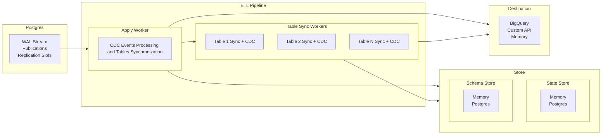

# ETL Architecture Overview

**Understanding how ETL components work together to replicate data from Postgres**

ETL's architecture centers around four core abstractions that work together to provide reliable, high-performance data replication: `Pipeline`, `Destination`, `SchemaStore`, and `StateStore`. This document explains how these components interact and coordinate data flow from Postgres logical replication to target systems.

A diagram of the overall architecture is shown below:



## Core Abstractions

### Pipeline

The Pipeline is ETL's central component that orchestrates all replication activity. It manages worker lifecycles, coordinates data flow, and handles error recovery.

**Key responsibilities:**

- Initializes the state of the pipeline
- Spawns the apply worker and table sync workers pool
- Tracks workers handles to wait for their termination
- Exposes the shutdown mechanism for gracefully terminating the pipeline

### Destination

The `Destination` trait defines how replicated data is delivered to target systems:

```rust
pub trait Destination {
    fn truncate_table(&self, table_id: TableId) -> impl Future<Output = EtlResult<()>> + Send;

    fn write_table_rows(
        &self,
        table_id: TableId,
        table_rows: Vec<TableRow>,
    ) -> impl Future<Output = EtlResult<()>> + Send;

    fn write_events(&self, events: Vec<Event>) -> impl Future<Output = EtlResult<()>> + Send;
}
```

The trait provides three operations:

- `truncate_table`: clears destination tables before bulk loading.
- `write_table_rows`: handles bulk data insertion during initial synchronization.
- `write_events`: processes streaming replication changes.

### SchemaStore

The `SchemaStore` trait manages table schema information:

```rust
pub trait SchemaStore {
    fn get_table_schema(
        &self,
        table_id: &TableId,
    ) -> impl Future<Output = EtlResult<Option<Arc<TableSchema>>>> + Send;

    fn get_table_schemas(&self) -> impl Future<Output = EtlResult<Vec<Arc<TableSchema>>>> + Send;

    fn load_table_schemas(&self) -> impl Future<Output = EtlResult<usize>> + Send;

    fn store_table_schema(
        &self,
        table_schema: TableSchema,
    ) -> impl Future<Output = EtlResult<()>> + Send;
}
```

The store follows a cache-first pattern: `load_table_schemas` populates an in-memory cache at startup, while `get_table_schemas` methods read only from cache for performance. `store_table_schema` implements dual-write to both persistent storage and cache.

### StateStore

The `StateStore` trait manages replication state and table mappings:

```rust
pub trait StateStore {
    fn get_table_replication_state(
        &self,
        table_id: TableId,
    ) -> impl Future<Output = EtlResult<Option<TableReplicationPhase>>> + Send;

    fn get_table_replication_states(
        &self,
    ) -> impl Future<Output = EtlResult<HashMap<TableId, TableReplicationPhase>>> + Send;

    fn load_table_replication_states(&self) -> impl Future<Output = EtlResult<usize>> + Send;

    fn update_table_replication_state(
        &self,
        table_id: TableId,
        state: TableReplicationPhase,
    ) -> impl Future<Output = EtlResult<()>> + Send;

    fn rollback_table_replication_state(
        &self,
        table_id: TableId,
    ) -> impl Future<Output = EtlResult<TableReplicationPhase>> + Send;

    fn get_table_mapping(
        &self,
        source_table_id: &TableId,
    ) -> impl Future<Output = EtlResult<Option<String>>> + Send;

    fn get_table_mappings(
        &self,
    ) -> impl Future<Output = EtlResult<HashMap<TableId, String>>> + Send;

    fn load_table_mappings(&self) -> impl Future<Output = EtlResult<usize>> + Send;

    fn store_table_mapping(
        &self,
        source_table_id: TableId,
        destination_table_id: String,
    ) -> impl Future<Output = EtlResult<()>> + Send;
}
```

Like `SchemaStore`, `StateStore` uses cache-first reads with `load_*` methods for startup population and dual-write patterns for updates.

The store tracks both replication progress through `TableReplicationPhase` and source-to-destination table name mappings.

## Data Flow Architecture

### Worker Coordination

ETL's data flow is orchestrated through two types of workers.

#### Apply Worker

- Processes Postgres logical replication stream
- Spawns table sync workers when new table are discovered
- Coordinates with table sync workers through shared state
- Handles final event processing for tables in `Ready` state

#### Table Sync Workers

- Perform bulk copying of existing table data
- Coordinate handoff to apply worker when synchronization completes
- Multiple table sync workers run in parallel, limited by configured semaphore to bound number of connections

### Worker Startup Sequence

The Pipeline follows this startup sequence:

1. **Pipeline Initialization**: Establishes Postgres connection and loads cached state
2. **Apply Worker Launch**: Creates and starts the primary apply worker first
3. **Table Discovery**: Apply worker identifies tables requiring synchronization
4. **Table Sync Spawning**: Apply worker spawns table sync workers for tables in `Init` state
5. **Coordination**: Workers communicate through shared state store
6. **Streaming**: Apply worker starts streaming replication events of table in `Ready` state and at every commit point
   checks for new tables to synchronize

_The apply worker always starts first because it coordinates the overall replication process and spawns table sync workers on demand._

### Table Replication Phases

Each table progresses through distinct phases during replication:

```rust
pub enum TableReplicationPhase {
    Init,
    DataSync,
    FinishedCopy,
    SyncWait,
    Catchup { lsn: PgLsn },
    SyncDone { lsn: PgLsn },
    Ready,
    Errored { reason: String, solution: Option<String>, retry_policy: RetryPolicy },
}
```

**Phase Ownership and Transitions:**

- **Init**: The table is discovered and ready to be copied
- **DataSync**: The table copy has started and is in progress
- **FinishedCopy**: The table has been fully copied and is ready to start CDC streaming
- **SyncWait**: The table is ready to start CDC streaming and is waiting for the apply worker to tell which LSN to catchup
- **Catchup**: The table is catching up to the the LSN specified by the apply worker
- **SyncDone**: The table has caught up to the LSN specified by the apply worker
- **Ready**: The table is now copied and caught up with the apply worker, now all events are processed by the apply worker for this table
- **Errored**: The table has encountered an error and is excluded from replication until a rollback is performed

## Next Steps

Now that you understand ETL's architecture:

- **Build your first pipeline** → [First Pipeline Tutorial](../tutorials/first-pipeline.md)
- **Implement custom components** → [Custom Stores and Destinations](../tutorials/custom-implementations.md)
- **Configure Postgres properly** → [Configure Postgres for Replication](../how-to/configure-postgres.md)

## See Also

- [Build Your First ETL Pipeline](../tutorials/first-pipeline.md) - Hands-on tutorial using these components
- [Custom Stores and Destinations](../tutorials/custom-implementations.md) - Implement your own stores and destinations
- [API Reference](../reference/index.md) - Complete trait documentation
- [Configure Postgres for Replication](../how-to/configure-postgres.md) - Set up the source database
